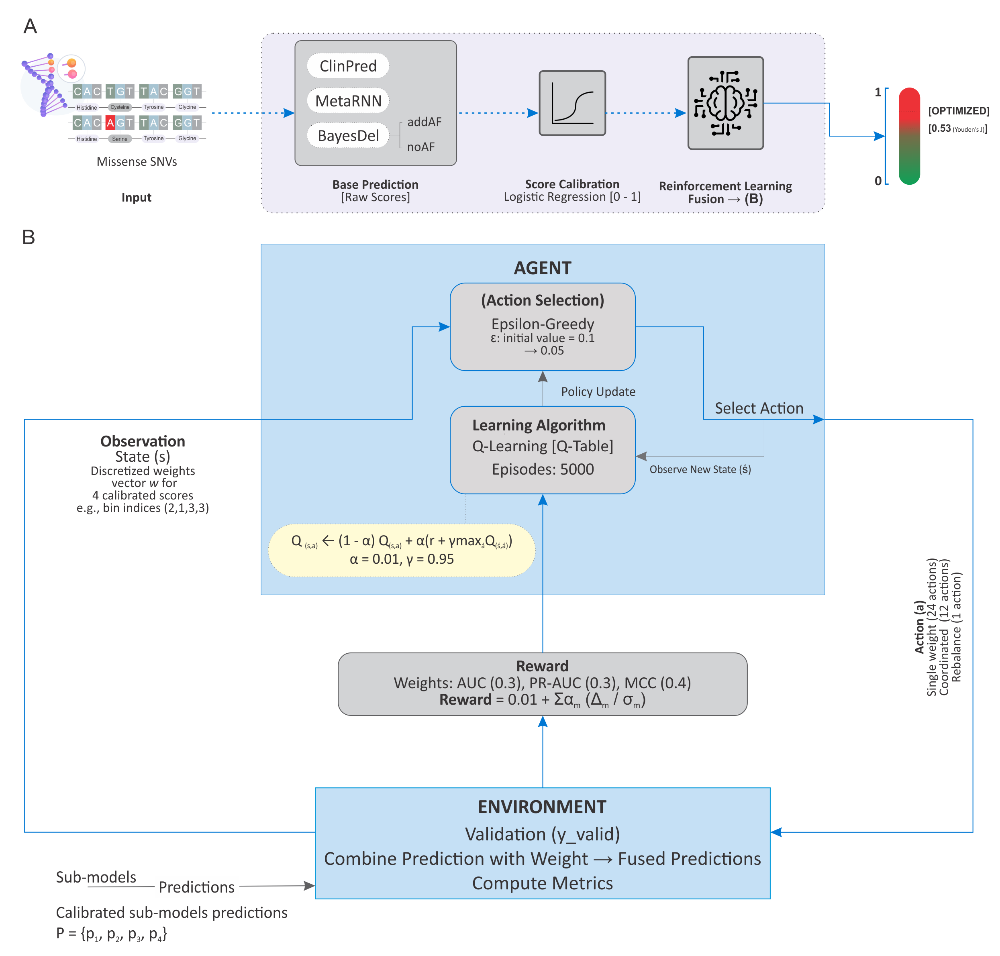

# GenixRL: Advancing Missense Variant Prediction and VUS Reclassification
## via a Dynamic Reinforcement Learning Agent
GenixRL is a state-of-the-art ensemble model for predicting the pathogenicity of missense variants. It uses a novel reinforcement learning (RL) framework to dynamically determine the optimal weights for combining scores from complementary predictors (BayesDel_addAF, BayesDel_noAF, ClinPred, and MetaRNN) to classify missense variants as 'Pathogenic' or 'Benign'.

This repository contains the prediction script to run the pre-trained GenixRL model on your own variant data.


**The GenixRL Ensemble Framework and Reinforcement Learning Mechanism.**
---

## Features

-   **State-of-the-Art Accuracy:** Outperforms over 29 existing predictors on independent benchmarks.
-   **Flexible Input:** Predict pathogenicity for a single variant (genomic or HGVS notation).
-   **Automated Annotation:** Batch process raw variant lists (from VCF, CSV, or TXT files) by automatically fetching scores from a local dbNSFP database.
-   **Fast Mode:** Directly predict on pre-annotated files containing the required sub-model scores, bypassing the slow dbNSFP lookup for rapid, large-scale analysis.

---

## Installation

**1. Clone the Repository**

**Crucial:** This repository uses Git LFS to manage the model files. You must have Git LFS installed to clone it correctly.

```bash
# First, install Git LFS from: https://git-lfs.github.com/
git lfs install

# Then, clone the repository
git clone https://github.com/shabbas313/GenixRL.git
cd GenixRL
```

**2. Create a Conda/Virtual Environment (Recommended)**

```bash
# Using Conda
conda create -n genixrl python=3.9
conda activate genixrl

# Or using venv
python -m venv venv
source venv/bin/activate  # On Windows use `venv\Scripts\activate`
```

**3. Install Dependencies**

```bash
Step No. 1: Install all required third-party libraries
pip install -r requirements.txt
```

```bash
Step No. 2: Install GenixRL, making the predict.py script available
pip install .
```
**4. Download Annotation Database (for Annotation Mode only)**

If you plan to use the automated annotation mode (`--variant` or `--input-file`), GenixRL needs a local, tabix-indexed database file containing the required sub-model scores.

#### Option A: Download the Pre-Processed Database (Recommended)

To make setup easy, we have pre-compiled the necessary scores from dbNSFP v5.2a into a smaller, optimized database file. This is the fastest way to get started.

-   **Download the database and its index from Zenodo:**
    -   `genixrl_scores_db.tsv.gz` (Database File)ss
    -   `genixrl_scores_db.tsv.gz.tbi` (Index File)
    [](https://doi.org/10.5281/zenodo.17151994)
-   Place both files in a convenient location. You will provide the path to this `.tsv.gz` using the --dbnsfp-path argument when running the script.

#### Option B: Create a Custom Database from dbNSFP

If you prefer to build the database yourself from the full dbNSFP file, you can use the provided helper script.

-   **Step 1: Download the full dbNSFP file.**
    -   You will need `dbNSFP5.2a_variant.tsv.gz` (or your preferred version).

-   **Step 2: Run the creation script.**
    -   Use the `create_custom_db.py` script included in this repository to extract the necessary columns and create a GenixRL-compatible database.
        ```bash
        python scripts/create_custom_db.py
        ```
    -   This script will automatically create the tabix index file (`.tbi`) for you.
---

## Usage

The primary script is `scripts/predict.py`. It supports three mutually exclusive input modes.
The model files and medians are located by default in `data/outputs/`.

### The GenixRL Prediction Tiers

The output column `GenixRL_Predictions` will have one of three values:
-   **Benign**: Score < optimal threshold (determined from training i.e., 0.532).
-   **Pathogenic**: Score is between the optimal and strong thresholds.
-   **High-Confidence Pathogenic**: Score ≥ strong threshold (default: 0.709). This threshold can be adjusted with the `--strong-threshold` flag.

## Quick Start

#### Mode 1: Predict a Single Variant

Quickly annotate and predict a single variant. GenixRL will use the default annotation database unless a different one is specified with --dbnsfp-path.

-   **By Genomic Coordinates:**
	```bash
    python scripts/predict.py --variant "6:32040871:C:A"
    ```
-   **With  a Custom Database**
	```bash
    python scripts/predict.py --variant "6:32040871:C:A" --dbnsfp-path /path/to/your/dbNSFP5.2a_variant.tsv.gz
    ```
	
#### Mode 2: Predict a Batch of Variants (Annotation Mode)

Annotate and predict a list of variants from a VCF, CSV, or TXT file.

-   **Example Input (`data/ex_1.csv`):**
    ```
    1,881918,C,T
    7,140453136,A,T
    ```

-   **Command:**
    ```bash
    python scripts/predict.py \
      --input-file data/ex_1.csv \
      --output-file data/ex_1_predictions.csv \
      --dbnsfp-path /path/to/your/genixrl_scores_db.tsv.gz
    ```

#### Mode 3: Predict a Pre-Annotated File (Fast Mode)

Directly predict on a file that already contains the necessary sub-model scores. This is the fastest method and **does not require dbNSFP**.

-   **Example Input (`data/ex_2.csv`):**
    *The file must contain the columns: `ClinPred_score`, `BayesDel_addAF_score`, `BayesDel_noAF_score`, `MetaRNN_score`.*
    ```csv
    chrom,pos,ref,alt,ClinPred_score,BayesDel_addAF_score,BayesDel_noAF_score,MetaRNN_score
    1,881918,C,T,0.99,0.55,-0.12,0.85
    7,140453136,A,T,0.01,-0.8,.,0.11
    ```

-   **Command:**
    ```bash
    python scripts/predict.py \
	--pre-annotated-file data/ex_2.csv \
	--output-file data/ex_2_predictions.csv
    ```

### Advanced Usage: Customizing Thresholds and Models

-   **Change the "High-Confidence Pathogenic" Threshold:**
    ```bash
    python scripts/predict.py \
      --pre-annotated-file data/example_pre_annotated.csv \
      --output-file results/custom_thresh_preds.csv \
      --strong-threshold 0.9
    ```
	
-   **Use a Different Trained Model:**
    ```bash
    python scripts/predict.py \
      --input-file data/example_variants.txt \
      --output-file data/other_model_preds.csv \
      --model-dir /path/to/your/other_model_folder/ \
      --timestamp <other_model_timestamp>
    ```

### OPTIONAL: To train and evaluate model with new datasets
-   **To train:**
    ```bash
    python scripts/train.py 
    ```
Ensure the required training data is present in the data/ directory.

-   **To Evaluate on Independent Set**
	```bash
    python scripts/evaluate_model.py 
    ```
-   **To Optimize Clinical Utility**
	```bash
    python scripts/domain_specific.py
    ```
---
## Citation

If you use GenixRL in your research, please cite our paper:

> [Author, A., Author, B., et al. (Year). GenixRL: Advancing Missense Variant Prediction... *Journal Name*.] 
